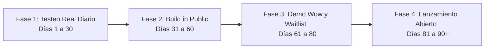

# Plan de Marketing: Alfonso Autónomo
**Estrategia: "Pies de plomo, no despacio"**
*Período de Ejecución: 3-4 meses para máximo impacto y ruido controlado.*

> [!IMPORTANT]
> **Nota de Contexto y Estrategia de Calidad:**
> Dado que Alfonso actualmente solo ha superado pruebas unitarias internas y validaciones manuales del desarrollador, **bajo ningún concepto se debe asumir que el software no dará problemas al ser ejecutado por otros usuarios.** 
> Para ir con pies de plomo, el plan exige una fase previa de **Testeo Real Diario** con un grupo de clientes de confianza antes de realizar cualquier campaña de marketing masiva.

---

## 1. Posicionamiento y Propuesta de Valor Única (USP)

Para hacer ruido sin arriesgar la reputación ni incurrir en responsabilidades legales ("pies de plomo"), el marketing debe girar en torno a tres pilares indiscutibles:

1. **Privacidad Radical (Local-First):** "Tus certificados y datos bancarios nunca suben a la nube. Se quedan en tu ordenador". Esto nos diferencia radicalmente de competidores SaaS como TaxDown, Declarando o Holded.
2. **El Enfoque "Pre-Trámite / One-Click":** Alfonso prepara el trabajo y auto-rellena el borrador, pero **tú** (el autónomo) eres quien hace el clic final de presentación en la web de la AEAT. Alfonso actúa como un copiloto de vuelo, no como el piloto automático.
3. **Preparación Técnica para Verifactu (2027):** Anticipar el cambio regulatorio. Alfonso no es solo un asistente de IA de moda; es una herramienta diseñada para cumplir con la ley de facturación electrónica inalterable y encadenamiento criptográfico local.

---

## 2. Estrategia por Fases (Cronograma a 3 Meses)

### Cronograma de Actividades

| Fase | Duración | Actividad Principal | Foco del Mensaje / Objetivo Técnico |
| :--- | :--- | :--- | :--- |
| **Fase 1: Testeo Real Diario** | Días 1 a 30 | Pruebas diarias en local con 5-10 clientes de confianza | **Foco Interno:** Encontrar fallos de entorno, problemas de permisos en Windows, y bugs en el parseo de facturas reales en ordenadores ajenos. |
| **Fase 2: Build in Public** | Días 31 a 60 | Documentar la evolución en LinkedIn/X | Compartir aprendizajes técnicos, cómo solucionamos los bugs reportados y la arquitectura de privacidad. |
| **Fase 3: El Efecto Wow Seguro** | Días 61 a 80 | Demos grabadas con datos ficticios + Lista de Espera | Demostrar el funcionamiento de Alfonso interactuando con la web de la AEAT e invitar al registro de la lista de espera. |
| **Fase 4: Lanzamiento Controlado** | Días 81 a 90+ | Apertura de descargas progresiva | Escalar a más usuarios de forma paulatina para garantizar soporte. |

---

### Fase 1: Testeo Real Diario en Entorno Controlado (Días 1 a 30)
*Objetivo: Estabilizar el software en la "vida real" antes de publicitarlo. Es inviable y arriesgado confiar en que no dará errores.*

*   **Acciones:**
    *   **Distribución a Clientes Amigos (5 a 10 personas):** Entregar una versión preliminar de Alfonso a autónomos conocidos para que la utilicen en su día a día técnico.
    *   **Recolección de Logs y Errores:** Establecer una vía rápida (ej. grupo de WhatsApp o Telegram privado) para reportar errores de compatibilidad, problemas de rendimiento de SQLite, fallos de la extensión en diferentes navegadores, etc.
    *   **Simulación Fiscal:** Asegurarse de que las pruebas con sus datos reales se usen solo para generar borradores y que siempre verifiquen visualmente el resultado antes de cualquier envío de prueba.

### Fase 2: Construcción en Público y Autoridad (Días 31 a 60)
*Objetivo: Utilizar la honestidad técnica para ganar confianza.*

*   **Acciones:**
    *   **Campaña "Build in Public" (LinkedIn/X):** Compartir cómo se han ido resolviendo los problemas del testeo real diario (ej. *"Cómo optimizamos la velocidad de lectura de PDFs en ordenadores con pocos recursos"*).
    *   **Educación sobre Privacidad:** Explicar con diagramas sencillos por qué la arquitectura local-first es la única forma segura de automatizar impuestos sin delegar el certificado digital del usuario a servidores de terceros.

### Fase 3: Demos de Impacto Visual (Días 61 a 80)
*Objetivo: Generar deseo de uso mostrando a Alfonso funcionando de forma fluida.*

*   **Acciones:**
    *   **Demos en Vídeo ("GPS de Hacienda"):** Grabar a Alfonso rellenando un borrador del modelo 303 en el navegador con datos ficticios. Al haber pulido los bugs en la Fase 1, la demo será robusta y real.
    *   **Lanzamiento de la Waitlist (Lista de Espera):** Habilitar una landing page minimalista para captar correos de autónomos interesados en la versión de lanzamiento.

### Fase 4: Lanzamiento Progresivo (Días 81 a 90+)
*Objetivo: Lanzar de forma escalonada para que el volumen de soporte no abrume al desarrollo.*

*   **Acciones:**
    *   **Descarga por Lotes:** Enviar el instalador a los usuarios de la lista de espera en grupos de 50 en 50 para vigilar que el software no de problemas imprevistos en sistemas operativos no probados.
    *   **Campaña de Testimonios:** Mostrar el feedback real del grupo inicial de testers diarios de la Fase 1.

---

## 3. Mensajes Clave (Copywriting)

| Ángulo | Mensaje Gancho | Racional de Seguridad (Pies de Plomo) |
| :--- | :--- | :--- |
| **Seguridad Real** | *"Probado en el mundo real por autónomos reales antes de estar disponible para ti."* | El testeo previo se convierte en un argumento de venta. |
| **Control Absoluto** | *"Alfonso prepara el borrador en tu PC, tú decides cuándo enviarlo a la AEAT."* | El usuario final sigue siendo el firmante legal. |
| **Privacidad** | *"Tus impuestos no son asunto de OpenAI o Google. Son tuyos."* | Posicionamiento local-first frente a soluciones SaaS en la nube. |

---

## 4. Gestión de Riesgos (El "Pies de Plomo")

1. **No Asumir Estabilidad:** El desarrollo local es propenso a fallos por diferencias de hardware, antivirus y versiones de navegador. El testeo en la Fase 1 es obligatorio.
2. **Uso Exclusivo de Entornos de Prueba para Demos:** Todo material promocional en vídeo debe utilizar datos ficticios.
3. **Cláusula de Exención de Responsabilidad:** El software debe dejar claro en el acuerdo de licencia y en la interfaz que es un asistente de soporte y que el autónomo es responsable de la exactitud de los datos declarados.
