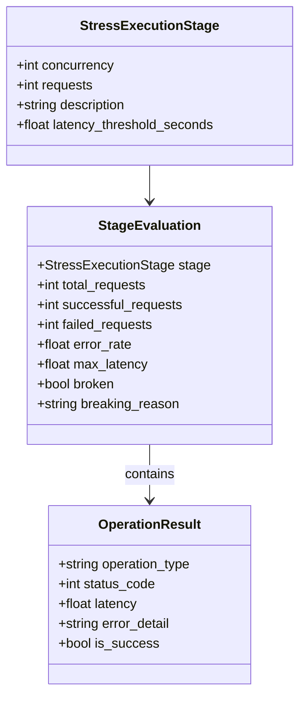

# Modelo de Datos y Contratos de Integridad de Tests (Spec 001)

## 1. Entidades de Evaluación de Tests de Estrés

### Reglas de Validación
1. **Invariante de Fallo Ruidoso**:
   - Si `StageEvaluation.error_rate > 0.0` (o el umbral fijado contractualmente), el test DEBE fallar inmediatamente con aserción explícita.
   - Prohibido cualquier `return` anticipado que no lance excepción o assertion error.
2. **Invariante de Inalterabilidad de Veri*Factu**:
   - Ninguna suite de tests puede alterar el catálogo de triggers de la base de datos (`trg_prevent_delete_verifactu`, `trg_prevent_update_verifactu`).
   - Las pruebas de verificación de integridad vacía deben aislarse en conexiones independientes en memoria.
3. **Invariante de Trazabilidad en Seeders**:
   - Toda etapa de inserción o ingesta de leyes en ChromaDB debe emitir un log estructurado con `app_logger.info` con la cuenta exacta de registros modificados.
