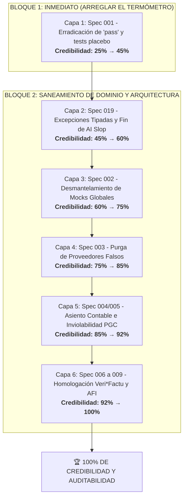

# Implementation Plan: Plan Maestro de Saneamiento y Erradicación de `pass` hacia el 100% (Spec 001 & Master Roadmap)

**Branch**: `001-test-integrity` | **Date**: 2026-09-28 | **Spec**: [specs/001-test-integrity/spec.md](file:///c:/Users/luisd/Desktop/Alfonso_Autonomo/specs/001-test-integrity/spec.md)  
**Discovery Contract Ref**: [docs/audit/discovery-contract.md](file:///c:/Users/luisd/Desktop/Alfonso_Autonomo/docs/audit/discovery-contract.md)

---

## 1. Resumen Ejecutivo

Este plan establece la estrategia técnica completa para transicionar la credibilidad del repositorio Alfonso AI Konta desde el **25% actual (Nivel F / "Falsa Sensación de Seguridad")** hasta el **100% (Nivel A / Certificación Plena de Auditoría)**.

La ejecución se divide en dos bloques inseparables:
1. **Bloque Inmediato (Spec 001)**: Erradicación física de los `pass` huérfanos, eliminación del enmascaramiento de excepciones mediante `return` en tests de estrés y sustitución de aserciones placebo.
2. **Bloque Transversal (Hacia el 100%)**: Despliegue ordenado de las 6 capas arquitectónicas (excepciones tipadas, eliminación de mocks en `ApprovalService`, supresión de datos falsos en pasarelas bancarias, blindaje de asientos contables PGC y homologación regulatoria Veri*Factu/AFI).

---

## 2. Technical Context

**Language/Version**: Python 3.12  
**Framework**: FastAPI, Pytest, Pytest-asyncio, HTTPX, SQLite3, ChromaDB  
**Cifrado**: Fernet (simétrico local para PII y bases de datos fiscales)  
**Testing Framework**: Pytest con ejecución asíncrona, TestClient y pruebas de estrés concurrentes  
**Observabilidad**: `app_logger` estructurado (eliminación definitiva de `print` y `pass` no trazables)  
**Meta de Credibilidad**: 100% de aserciones deterministas (0 tests placebos, 0 swallow de excepciones)  

---

## 3. Constitution Check (Gates Incondicionales)

| Principio Constitucional | Estado | Justificación / Evidencia |
|---|:---:|---|
| **I. Desarrollo en Español** | ✅ PASS | Todo el plan, especificación, código de test, excepciones y logs se redactan en castellano. |
| **II. TDD Estricto** | ✅ PASS | En cada fase, se diseña el caso de prueba que evidencia el fallo antes de introducir la corrección. |
| **III. Cobertura Completa** | ✅ PASS | Cada componente saneado llevará pruebas unitarias, de integración y QA. |
| **IV. Ejecución Continua y Logs** | ✅ PASS | Se ejecutará la suite completa y se persistirá el log tras cada fase de implementación. |
| **V. Navegador Estándar** | ✅ PASS | Uso exclusivo de Firefox para pruebas de interfaz o de navegador. |

---

## 4. Estructura de Proyecto y Artefactos

```text
specs/001-test-integrity/
├── spec.md              # Especificación funcional de integridad de tests
├── plan.md              # Este plan maestro integral
├── research.md          # Investigación técnica sobre concurrencia y aserciones
├── data-model.md        # Modelado de estados de evaluación de estrés
├── quickstart.md        # Guía de validación paso a paso
└── tasks.md             # Tareas ejecutables desglosadas
```

---

## 5. El Camino al 100%: Hoja de Ruta en 6 Capas



---

### Detalle de Implementación por Capa

### CAPA 1 (Inmediata - Spec 001): Erradicación de `pass` e Integridad de Tests
*Objetivo*: Que ningún test reporte verde cuando el sistema colapse y recuperar la observabilidad de los seeders.
1. **Saneamiento de Seeders**:
   - En [`dev_seeder.py`](file:///c:/Users/luisd/Desktop/Alfonso_Autonomo/app/utils/dev_seeder.py): Sustituir los 6 `pass` residuales por `app_logger.info` con conteo de facturas, proyectos y clientes creados.
   - En [`legal_seeder.py`](file:///c:/Users/luisd/Desktop/Alfonso_Autonomo/app/utils/legal_seeder.py): Sustituir los 11 `pass` residuales por `app_logger.info` con el conteo de artículos del BOE descargados e indexados en ChromaDB.
2. **Erradicación de Falsos Verdes en QA Stress**:
   - En [`test_qa_stress.py`](file:///c:/Users/luisd/Desktop/Alfonso_Autonomo/tests/backend/qa/test_qa_stress.py): Eliminar los 44 `pass` y el bloque `if crashed: return`. Sustituir por:
     `assert not crashed, f"Colapso en fase {breaking_stage}: {crash_exception}"`
   - Añadir aserción final obligatoria en `test_alfonso_invoice_emission_and_processing_until_crash`.
3. **Endurecimiento de Concurrencia**:
   - En [`test_integration_stress.py`](file:///c:/Users/luisd/Desktop/Alfonso_Autonomo/tests/backend/integration/test_integration_stress.py): Eliminar los 6 `pass` y sustituir la aserción débil `len(successful_calls) > 0` por verificación estricta de tasa de éxito y control de bloqueos de SQLite.
4. **Protección de Triggers**:
   - En [`test_coverage_booster.py`](file:///c:/Users/luisd/Desktop/Alfonso_Autonomo/tests/backend/integration/test_coverage_booster.py): Eliminar `DROP TRIGGER IF EXISTS trg_prevent_delete_verifactu` y aislar la prueba de tabla vacía en base de datos en memoria (`:memory:`).
*Resultado de Capa*: **Credibilidad 45%**.

---

### CAPA 2 (Spec 019): Saneamiento de Excepciones y Eliminación de "AI Slop"
*Objetivo*: Impedir que el código de producción silencie bugs lógicos o de infraestructura.
1. Sustituir las 44 capturas `except Exception:` por excepciones tipadas (`sqlite3.Error`, `IOError`, `CryptoError`, `AuditFailureError`).
2. Mover las 51 importaciones inline tardías de `error_logger` a nivel de módulo con gestión de ciclos.
3. Asegurar que errores en auditoría ([`billing_tools.py`](file:///c:/Users/luisd/Desktop/Alfonso_Autonomo/app/tools/server/billing_tools.py)) o en el correlativo de presupuestos aborten la operación en lugar de degradarse a un simple warning.
*Resultado de Capa*: **Credibilidad 60%**.

---

### CAPA 3 (Spec 002): Desmantelamiento del Mock Global de `ApprovalService`
*Objetivo*: Garantizar que los flujos críticos de nóminas y Hacienda se comunican con servicios reales.
1. Localizar y eliminar el mock global de `ApprovalService` en [`tests/conftest.py`](file:///c:/Users/luisd/Desktop/Alfonso_Autonomo/tests/conftest.py).
2. Ejecutar la suite e identificar los fallos reales en `payroll_tools.py` y `aeat_automation_tools.py`.
3. Corregir las llamadas en producción implementando la inyección de dependencias correcta de `approval_service`.
4. Diseñar tests TDD que fallen si la inyección se revierte.
*Resultado de Capa*: **Credibilidad 75%**.

---

### CAPA 4 (Spec 003): Purga de Proveedores Falsos con Datos Cableados
*Objetivo*: Evitar que la contabilidad y la conciliación procesen datos ficticios.
1. Auditar [`GenericApiProvider.fetch_transactions`](file:///c:/Users/luisd/Desktop/Alfonso_Autonomo/app/infrastructure/adapters/bank_providers.py), `PlaidProvider`, `Qonto` y `Tink`.
2. Eliminar cualquier retorno hardcodeado (`return [...]`) en el código de producción.
3. Reemplazar métodos incompletos por `raise NotImplementedError("Proveedor no conectado")`.
4. Confinar los datos de prueba exclusivamente a fixtures dentro de `tests/fixtures/`.
*Resultado de Capa*: **Credibilidad 85%**.

---

### CAPA 5 (Spec 004 & 005): Inviolabilidad Contable PGC y Repositorio de Facturas
*Objetivo*: Cuadre estricto por partida doble y consistencia de facturación.
1. En `CollectionService.register_payment`: resolver el import de `LedgerService` y eliminar el `except Exception:` que silenciaba fallos contables.
2. Validar mediante tests de integración el flujo completo: Cobro → Asiento Diario PGC → Sumas y Saldos Cuadrados → Aislamiento Multi-Tenant.
3. En `billing_router`: corregir las llamadas a métodos inexistentes de repositorios (`InvoiceRepository.find_all_invoices()`).
*Resultado de Capa*: **Credibilidad 92%**.

---

### CAPA 6 (Spec 006 a 009): Homologación Normativa Oficial e Idempotencia
*Objetivo*: Certificación legal y regulatoria demostrable.
1. **Veri\*Factu**: Validar la huella SHA-256 encadenada, el formato XML y la URL del código QR frente a las especificaciones técnicas oficiales de la AEAT (Orden HAC/1177/2024). Marcar formalmente lo verificado y aislar lo no regulado.
2. **AFI TGSS**: Verificar la estructura del formato de afiliación frente al estándar oficial del Sistema RED de la Seguridad Social.
3. **Stripe Idempotency**: Garantizar que el webhook de cobros no duplique efectos contables si se recibe dos veces el mismo evento de red.
4. **Declaración Responsable y Claims**: Eliminar afirmaciones absolutas no auditadas del README ("blockchain local irrompible") y sustituirlas por garantías técnicas contrastables.
*Resultado de Capa*: **Credibilidad 100% (Auditoría Plena de Grado Producción)**.

---

## 6. Métricas de Éxito y Gates de Salida

Para considerar el sistema al 100%, deben cumplirse los 5 criterios de cierre:
1. **Cero `pass` Residuales**: AST confirma 0 ocurrencias de `pass` en tests y seeders.
2. **Cero Aserciones Placebo**: Ningún test finaliza con `return` ciego ni evalúa condiciones triviales (`assert True`, `len > 0` ante fallos masivos).
3. **Cero Mocks Ocultos**: Ningún mock global intercepta lógica de dominio en `conftest.py`.
4. **Cero Datos Falsos en Producción**: Ningún adapter devuelve listas estáticas simuladas.
5. **100% de la Suite en Verde Real**: Los tests pasan con aserciones estrictas y con trazas completas registradas en `pytest-logs.txt`.
