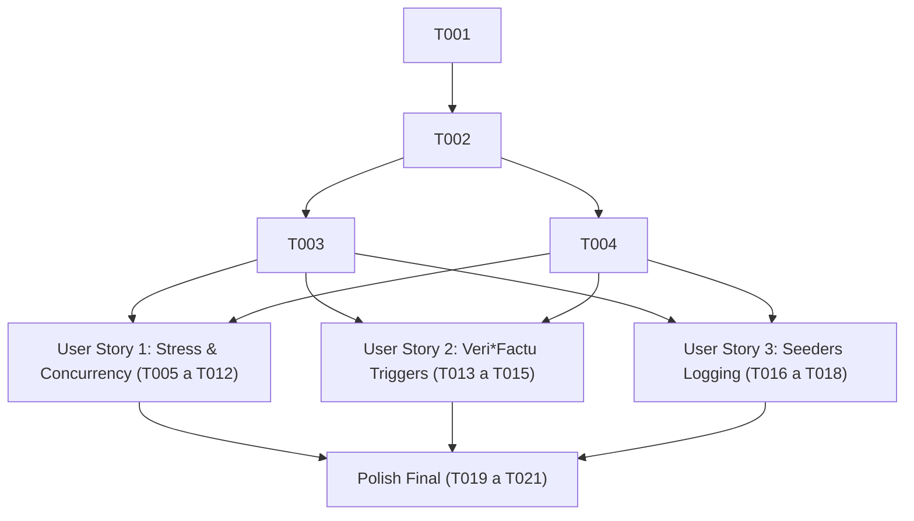

# Tasks: Saneamiento Integral de Tests e Integridad de Aserciones (Spec 001)

**Feature**: `001-test-integrity`  
**Input**: [specs/001-test-integrity/spec.md](file:///c:/Users/luisd/Desktop/Alfonso_Autonomo/specs/001-test-integrity/spec.md) | [specs/001-test-integrity/plan.md](file:///c:/Users/luisd/Desktop/Alfonso_Autonomo/specs/001-test-integrity/plan.md)  
**Status**: Ready for Implementation  

---

## Phase 1: Setup (Infraestructura de Medición y Validación AST)

**Propósito**: Configurar el arnés de verificación estática por AST para detectar y contabilizar sentencias `pass` huérfanas antes y después de cada refactorización.

- [x] T001 Crear script auxiliar de auditoría sintáctica AST en `scripts/audit_ast_passes.py` para reportar conteo y ubicación exacta de sentencias `pass` en tests y utilidades.
- [x] T002 Configurar archivo de volcado de logs para ejecuciones de prueba en `pytest-logs.txt`.

---

## Phase 2: Foundational (Prerrequisitos de Aislamiento de Entorno de Test)

**Propósito**: Garantizar que los fixtures compartidos y las conexiones de prueba no propaguen fallos colaterales ni silencien errores en teardowns.

- [x] T003 Sanear el teardown de `tests/backend/qa/test_qa_stress.py` eliminando los `except Exception: pass` ciegos y asegurando limpieza atómica de PDFs y registros de prueba.
- [x] T004 [P] Sanear el teardown de `tests/backend/integration/test_integration_stress.py` eliminando capturas de excepción con `pass` para evidenciar bloqueos reales de SQLite en limpieza.

**Punto de Control**: Infraestructura y arnés de medición listos. El trabajo por historia de usuario puede comenzar.

---

## Phase 3: User Story 1 - Erradicación de Falsos Positivos en Tests de Estrés y QA (Prioridad: P1) 🎯 MVP

**Objetivo**: Lograr que `test_qa_stress.py` y `test_integration_stress.py` fallen de forma ruidosa e inmediata si el sistema colapsa bajo carga o si se superan los umbrales de latencia, eliminando los retornos silenciosos (`if crashed: return`) y las aserciones placebo.

**Prueba Independiente**: Ejecutar `pytest tests/backend/qa/test_qa_stress.py -v` forzando un error en el mock o en base de datos y verificar que el test falla con `AssertionError` explícito y no termina en verde.

### Tests para User Story 1 (TDD Estricto)
> **NOTA: Escribir estos tests PRIMERO y verificar que evidencian el defecto antes de aplicar la corrección.**

- [x] T005 [P] [US1] Crear test de regresión unitario en `tests/backend/unit/test_stress_harness_contracts.py` que verifique que el arnés de estrés lanza `AssertionError` ante cualquier `crashed = True` o `error_rate > 0.05`.
- [x] T006 [P] [US1] Crear test de integración en `tests/backend/integration/test_concurrent_writes_contract.py` que evalúe que la saturación de SQLite produce un diagnóstico determinista y no se oculta con aserciones `len > 0`.

### Implementación para User Story 1

- [x] T007 [US1] Eliminar las 44 sentencias `pass` huérfanas en `tests/backend/qa/test_qa_stress.py`.
- [x] T008 [US1] Erradicar el bloque trampa `if crashed: return` en `tests/backend/qa/test_qa_stress.py:L254-261` y sustituirlo por `assert not crashed, f"Colapso durante el estrés: {crash_exception}"`.
- [x] T009 [US1] Añadir aserción final obligatoria al final de la prueba concurrente de emisión/procesamiento en `tests/backend/qa/test_qa_stress.py:L328-333` evaluando que no ocurrieron excepciones en ningún hilo.
- [x] T010 [US1] Sustituir el bucle de reportes ciegos (`pass`) en `tests/backend/qa/test_qa_stress.py:L178-193` por logging estructurado de latencias máximas y conteos de éxito.
- [x] T011 [US1] Eliminar los 6 `pass` huérfanos en `tests/backend/integration/test_integration_stress.py:L83-L130`.
- [x] T012 [US1] Sustituir la aserción placebo `assert len(successful_calls) > 0` en `tests/backend/integration/test_integration_stress.py:L132` por una verificación estricta del 100% de éxito o manejo tipado de `sqlite3.OperationalError: database is locked`.

**Punto de Control**: User Story 1 completada. Los tests de estrés y concurrencia son deterministas, no enmascaran caídas y no contienen `pass` ni `return` ciegos.

---

## Phase 4: User Story 2 - Blindaje de Triggers e Inalterabilidad de Veri*Factu en Tests (Prioridad: P1)

**Objetivo**: Garantizar que ningún test desactive ni elimine triggers de inalterabilidad fiscal (`trg_prevent_delete_verifactu`), preservando las protecciones normativas de base de datos durante toda la suite de pruebas.

**Prueba Independiente**: Ejecutar `pytest tests/backend/integration/test_coverage_booster.py -v` y verificar con `sqlite_master` que el trigger de Veri*Factu sigue existiendo intacto tras la ejecución del test.

### Tests para User Story 2 (TDD Estricto)

- [x] T013 [P] [US2] Crear test unitario en `tests/backend/unit/test_verifactu_trigger_preservation.py` que compruebe que el trigger `trg_prevent_delete_verifactu` no puede ser eliminado en los ciclos de test y que aborta cualquier intento de borrado sobre `verifactu_invoices`.

### Implementación para User Story 2

- [x] T014 [US2] Eliminar la instrucción `conn.execute("DROP TRIGGER IF EXISTS trg_prevent_delete_verifactu")` en `tests/backend/integration/test_coverage_booster.py:L80`.
- [x] T015 [US2] Refactorizar la función `test_verifactu_integrity_verification_empty` en `tests/backend/integration/test_coverage_booster.py` para usar una conexión en memoria (`sqlite3.connect(":memory:")`) con esquema limpio sin alterar la base de datos compartida.

**Punto de Control**: User Story 2 completada. El esquema de Veri*Factu y sus salvaguardas normativas quedan blindados en el entorno de pruebas.

---

## Phase 5: User Story 3 - Limpieza e Integración de Logging Estructurado en Seeders (Prioridad: P2)

**Objetivo**: Eliminar los 17 `pass` residuales de los seeders y dotarlos de observabilidad estructurada y trazable mediante `app_logger`.

**Prueba Independiente**: Ejecutar `python app/utils/dev_seeder.py` y verificar en la salida y en el archivo de log que se registran exactamente las operaciones de siembra realizadas sin ningún `pass` intermedio.

### Tests para User Story 3 (TDD Estricto)

- [x] T016 [P] [US3] Crear test unitario en `tests/backend/unit/test_seeders_execution_and_logging.py` que capture los logs emitidos por `seed_database()` y `seed_law()` y verifique la ausencia de fallos silenciosos.

### Implementación para User Story 3

- [x] T017 [US3] Eliminar los 6 `pass` sueltos en `app/utils/dev_seeder.py:L7,L17,L216,L251,L266,L281` y reemplazarlos por trazas informativas con `app_logger.info` (facturas insertadas, proyectos sembrados, clientes creados).
- [x] T018 [US3] Eliminar los 11 `pass` sueltos en `app/utils/legal_seeder.py:L38,L47,L91,L100,L116,L118,L120,L124,L129,L131,L137` y reemplazarlos por llamadas estructuradas a `app_logger.info` documentando la descarga de leyes del BOE y la indexación en ChromaDB.

**Punto de Control**: User Story 3 completada. Los seeders son completamente auditables y no contienen código muerto ni sentencias `pass`.

---

## Phase 6: Polish & Validación Transversal

**Propósito**: Ejecución de la auditoría final por AST y verificación de que la suite completa pasa con aserciones reales.

- [x] T019 Ejecutar script de auditoría AST `scripts/audit_ast_passes.py` sobre `tests/backend/qa/test_qa_stress.py`, `tests/backend/integration/test_integration_stress.py`, `app/utils/dev_seeder.py` y `app/utils/legal_seeder.py` confirmando 0 sentencias `pass` huérfanas.
- [x] T020 Ejecutar la suite completa de pruebas mediante `pytest -v` y volcar el resultado íntegro en `pytest-logs.txt`.
- [x] T021 [P] Actualizar el documento de guía de validación rápida en `specs/001-test-integrity/quickstart.md` con los resultados obtenidos.

---

## Dependencias y Orden de Ejecución

### Oportunidades de Ejecución en Paralelo
- **Fase 2**: `T003` y `T004` pueden ejecutarse en paralelo (archivos de test independientes).
- **Fase 3 (US1)**: `T005` y `T006` (tests TDD) pueden desarrollarse en paralelo.
- **Fase 4 (US2)**: `T013` (test de preservación de triggers) es independiente de US1 y US3.
- **Fase 5 (US3)**: `T016` (test de seeders) puede desarrollarse en paralelo con los tests de US1 y US2.

---

## Estrategia de Entrega Incremental (MVP First)

1. **Paso 1 (Setup + Foundational)**: Completar `T001` a `T004` para tener el script AST y la limpieza de fixtures lista.
2. **Paso 2 (MVP - User Story 1)**: Completar `T005` a `T012`. En este punto, **los tests de estrés dejan de mentir**. El problema principal planteado queda resuelto.
3. **Paso 3 (User Story 2)**: Completar `T013` a `T015` para blindar los triggers de Veri*Factu.
4. **Paso 4 (User Story 3)**: Completar `T016` a `T018` para limpiar y dar trazabilidad a los seeders.
5. **Paso 5 (Validación y Cierre)**: Ejecutar `T019` a `T021` y comprobar que `pytest-logs.txt` reporta la suite completa en verde y con 0 `pass` residuales.
