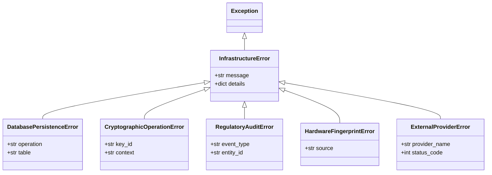

# Data Model & Error Taxonomy: Saneamiento de Excepciones "AI Slop" (Spec 019)

**Feature**: `019-saneamiento-excepciones-ai-slop`  
**Date**: 2026-09-28  
**Status**: Completed

---

## 1. Taxonomía de Excepciones del Sistema

Para erradicar la captura indiscriminada de `Exception`, se estandarizan los siguientes tipos y jerarquías de excepciones en el proyecto:



---

## 2. Contratos de Manejo de Error por Módulo

### 2.1 Facturación y Presupuestos (`billing_tools.py`)
- **Operación**: `DELETE_CLIENT`
  - *Error Potencial*: Fallo en `AuditLedgerService.log_audit_event`.
  - *Manejo*: Si la auditoría falla, registrar `error_logger.critical` y emitir señal de degradación de auditoría en la respuesta:
    ```python
    {
        "status": "warning",
        "client_id": cid,
        "audit_persisted": False,
        "message": "Cliente desactivado pero se produjo un error al registrar la traza de auditoría."
    }
    ```
- **Operación**: Generación de ID correlativo de presupuestos (`create_quote` / `_get_next_quote_id`)
  - *Error Potencial*: `decrypt(r["quote_id"])` lanza excepción por formato inválido o clave corrupta.
  - *Manejo*: Capturar específicamente excepciones criptográficas/de valor. Registrar advertencia detallada con el registro problemático e incrementar el contador o marcar el registro como corrupto sin asumir idéntico prefijo a ciegas.

### 2.2 Repositorio de Facturas (`invoice_repository.py`)
- **Operaciones**: Inserción, actualización y consulta de facturas.
- **Excepciones**: `sqlite3.IntegrityError`, `sqlite3.OperationalError`, `sqlite3.DatabaseError`.
- **Manejo**: Re-lanzar como `DatabasePersistenceError` o retornar error estructurado documentando la operación fallida, sin absorber `KeyError` o errores de código interno.

### 2.3 Validador de Licencia (`license_validator.py`)
- **Operaciones**: Lectura de `winreg` (Windows) o `/etc/machine-id` (Linux).
- **Excepciones**: `(OSError, FileNotFoundError, PermissionError, AttributeError)`.
- **Manejo**: Continuar con el siguiente componente de la huella hardware de manera explícita y documentada, sin importar `error_logger` en cada bloque.

### 2.4 Proveedores Bancarios (`bank_providers.py`)
- **Operaciones**: Peticiones HTTP a APIs bancarias (Nordigen / RedSys).
- **Excepciones**: `(httpx.HTTPError, httpx.TimeoutException, KeyError)`.
- **Manejo**: Propagar o encapsular en `ExternalProviderError` con mensaje explicativo para el usuario.
